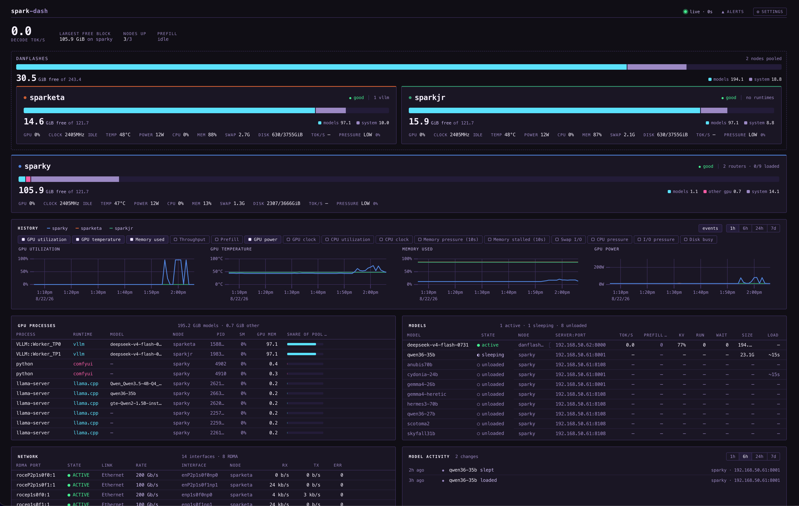

# spark-dash

A scalable web dashboard for a home cluster of NVIDIA GB10-based inferencing
servers (ASUS GX10 / "DGX Spark" class hardware), showing GPU/system health and
live metrics for the LLM inferencing jobs (llama.cpp router + vLLM) running on
them.

Supports single node and clusters.



Three GB10s — two pooled into a tensor-parallel cluster, one standalone. Cards
are draggable and can be paired side by side; every threshold shown is measured
for this hardware rather than guessed.

## Quickstart

Everything runs in Docker; nothing is installed on the base OS. There are two
stacks — `central/` on a monitoring host, and `node/` on each GB10 you want to
watch. They are deliberately not the same machine
([why](docs/deployment.md#why-not-on-a-gx10)).

You need Docker with Compose v2 on both, plus the NVIDIA Container Toolkit on
each node — the agent reads NVML. **No registry account and no `docker login`:
the images are built on the hosts that run them.**

### 1. Monitoring host

```bash
git clone <this repo's URL> spark-dash && cd spark-dash
./scripts/build-images.sh backend               # builds spark-dash-backend:latest

cd central
cp .env.example .env
$EDITOR .env                    # one value to change: ALERTMANAGER_EXTERNAL_URL

mkdir -p cluster prometheus targets alertmanager secrets
cp cluster.yml.example cluster/cluster.yml
$EDITOR cluster/cluster.yml     # your nodes: id, host, and what each one serves

# Required, not tidiness. Docker creates missing bind-mount sources owned by
# root and both containers run non-root; skip this and Prometheus crash-loops
# with a message that reads like a Prometheus bug.
sudo chown 65534:65534 prometheus alertmanager
sudo chown 10002:10002 targets

docker compose up -d
```

The dashboard is on `:8080`.

### 2. Each GB10 node

Build on the node itself — it is arm64, which avoids cross-building entirely:

```bash
git clone <this repo's URL> spark-dash && cd spark-dash
./scripts/build-images.sh agent                 # builds spark-dash-agent:latest

cd node
cp .env.example .env
$EDITOR .env                    # one value to change: BACKEND_URL
docker compose up -d
```

`BACKEND_URL` is genuinely the only edit, and the same `.env` then deploys
unchanged to every node: the agent takes its id from the host's hostname, and
takes which routers and vLLM endpoints to watch from `cluster.yml` on the
monitoring host rather than from its own config.

### 3. Check it

```bash
curl -s <monitoring-host>:8080/health | jq '{status, problems}'
```

`ok` with an empty `problems` means every node in `cluster.yml` is being
scraped. A node listed there but not yet running its agent appears in
`problems`, which is the intended way to notice a half-finished deploy.

Deploying from a registry instead of building on each host is the maintainer
path — see [building and shipping
images](docs/deployment.md#building-and-shipping-images). It needs
`PULL_POLICY=always` in each `.env`, for reasons the compose files spell out.

## Docs

- [Requirements](docs/requirements.md) — goals, current stack, functional/
  non-functional requirements.
- [Architecture](docs/architecture.md) — Prometheus for collection/storage,
  homegrown backend + frontend for the UI; component diagram; scaling approach.
- [Metrics catalog](docs/metrics.md) — exactly what's being collected, from
  vLLM, llama.cpp router mode, and GPU/system exporters, including GB10-specific
  caveats (unified memory, router autoload behavior).
- [Roadmap](docs/roadmap.md) — phased plan from single-node MVP to the full
  3-node cluster, plus open decisions.
- [App design](docs/app-design.md) — backend/frontend stack (FastAPI + Svelte 5),
  API surface, live-update contract, and panel/visual design rules.
- [Deployment](docs/deployment.md) — Docker-only deployment approach (base OS
  stays untouched) and the per-node/central Compose service breakdown.

## Bring your own dashboard

Prometheus holds everything the UI shows and 180 days of it, so building your
own views instead is a supported path rather than a workaround — the inference
engines are scraped *directly*, so latency histograms and per-request counters
the bundled frontend never renders are already stored.
[central/grafana/](central/grafana/) has an importable starter dashboard and,
more usefully, the list of ways this particular metric surface will mislead you.

[docs/roadmap.md](docs/roadmap.md) is the authoritative task list. Issue
tracking mirrors it on a LAN-internal Forgejo instance that is not reachable
from outside the network, so the roadmap file is the copy to read.

## License

[MIT](LICENSE).
