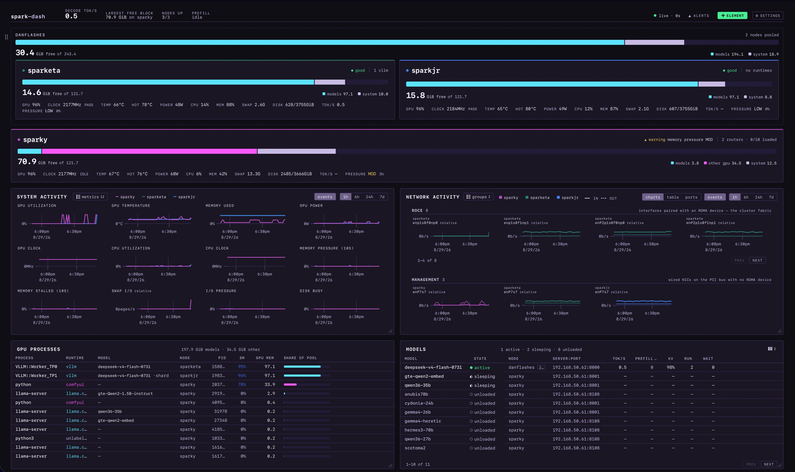
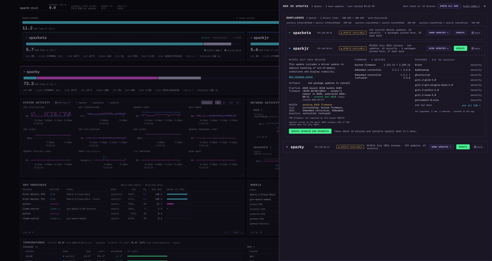

# spark-dash

A web dashboard for a home cluster of NVIDIA GB10 machines — ASUS GX10 / "DGX
Spark" class. It shows GPU and system health, and live metrics for the LLM jobs
running on them (llama.cpp router, vLLM, SGLang).

Works with one node or many.



Three GB10s: two pooled into a tensor-parallel cluster, one standalone. Every
threshold is measured for this hardware, not guessed, and the layout is
[yours to arrange](#the-page-is-yours).



[DGX OS updates](#5-optional-dgx-os-updates) on the same three machines, with
`sparkjr` expanded to show what the release would change.

Two details worth pointing at. The button says *update sparkjr and sparketa*
because those two pool memory — updating one without the other breaks the pair.
And *6 packages pinned here* means someone ran `apt-mark hold` on that node, so
the count isn't a misleading zero.

## What it monitors

**77 metric families per node**, live at 1–2s over a WebSocket and kept for 180
days in Prometheus. Read-only: it can't load, unload or kill anything.

**The GPU, as GB10 actually reports it.**

- Utilization, temperature, power, clocks.
- **Unified memory, read correctly.** NVML reports a total that never moves on
  GB10, so generic exporters show a flat line. The agent reads `/proc/meminfo`.
- **Throttle state** — `IDLE` / `PASS` / `LOCKED` / `THROTTLED`, judged only
  under load. On GB10 a throttle usually means power, not heat.
- **Memory pressure (PSI).** Contention shows up here before swap does.

**Which process is holding the memory.** Per-process GPU attribution, labelled
with the runtime that owns it — llama.cpp, vLLM, SGLang, ComfyUI. "97 GiB used"
becomes "97 GiB held by these two vLLM shards".

**Per-model inference state.**

- llama.cpp router: which models are loaded, sleeping or unloaded, slots in use,
  KV-cache occupancy, and a timeline of every load and unload.
- vLLM and SGLang are scraped directly by Prometheus, so their full metric
  surface is stored whether or not this UI draws it.
- **Decode and prefill counted separately.** Combined, they once read 47,672
  tok/s while the model was generating 48.

**The cluster as one machine.** Nodes sharing a `cluster:` name pool their
memory, so free space is summed within a cluster and never across one — a
fleet-wide total would describe space no single model could use.
Tensor-parallel workers show as shards of one job, and two alerts compare
cluster members against each other to catch the straggler.

**The fabric.** Every interface and RoCE port: link state, negotiated rate,
throughput, errors and drops. Unplug a port and you can exclude it from
alerting by name; the RoCE device behind it goes with it, since one cable
carries both. A ConnectX-7 that negotiates 10 Gb/sec instead of 200 is
otherwise invisible.

**Every sensor, not just the GPU.** A GB10 exposes 18–23 temperature sensors —
seven SoC zones, the NVMe, one per ConnectX port, the radio — ranked by how
close each is to *its own* limit, which differ by twenty degrees across one
machine. On this cluster an SoC zone hit 95.4°C while the GPU read 72°C.

**Alerting you can trust.** 34 rules, with push notifications via
[ntfy](https://ntfy.sh) — no account, no API key. Thermal bands come from each
node's own hardware limits, and you're told if a node falls back to a guess. A
GX10 sits at ~84°C doing routine work, so a generic 80°C threshold would page
you all day.

**History.** 15 metrics charted over 1h to 7d, per node or aggregated — GPU and
CPU utilization, clocks, temperature, power, memory, all four PSI signals, swap
and disk I/O, throughput and prefill.

**Each interface gets its own chart**, receive and transmit, over the same 1h to
7d. Sharing one axis doesn't work here: these links span six orders of
magnitude, so a busy management port would flatten a 200Gb RoCE link to zero.
Past a dozen links the card becomes a table, worst first, with a column saying
what put each row there.

**Optionally, NVIDIA release updates.** The dashboard can check every Spark
against NVIDIA's release recipes and install what's available: an *updates*
button in the header, and a panel showing what each update would change before
you start it. It runs NVIDIA's own sequence — `apt full-upgrade`,
`fwupdmgr upgrade`, restart — one Spark at a time over SSH.

**It's off until you set it up**, and that takes an SSH key and a login on each
Spark: [the quick setup](docs/fleet-updates-setup.md). Nothing installs on a
timer — the hourly part is a read-only check, and every update is a button
somebody pressed.

## The page is yours

Move, size, copy and put away any card. It's all remembered in the browser —
nothing is configured on the server.

- **Move it.** Drag by the grip in the left gutter, or use the arrow keys. Drop
  a card beside another to pair them side by side.
- **Size it.** Drag the bottom-right corner. Height moves one table row at a
  time so cards stay on a grid, and you can drag *past* the content to make two
  columns end level. Sideways flips between half and full width.
- **Too short for its content?** It pages. Or pick **Scroll** in Settings and
  cards scroll inside their box instead, headers staying put.
- **More than one.** `+ element` adds another copy of any card — one Network
  Activity showing RDMA ports, another showing charts.
- **Each card has its own menus.** Which metrics, which interface groups,
  charts or table or RDMA ports, which columns. Column edges drag.
- **Seven themes**, dark instrument panel through to paper and high contrast,
  plus a compact form for the node cards. **Reset layout** puts it all back.

## Quickstart

Everything runs in Docker; nothing is installed on the base OS. You install two
stacks: `central/` on a monitoring host, and `node/` on each GB10 you want to
watch.

Usually those are different machines
([why](docs/deployment.md#why-not-on-a-gx10)). If you only have the one, put
both on it — see
[single-host](docs/deployment.md#single-host--everything-on-one-gb10).

You need Docker with Compose v2 on both, plus the NVIDIA Container Toolkit on
each node — the agent reads NVML. **No registry account and no `docker login`:
the images are built on the hosts that run them.**

### 1. Monitoring host

```bash
git clone <this repo's URL> spark-dash && cd spark-dash
./scripts/build-images.sh backend               # builds spark-dash-backend:latest

cd central
cp .env.example .env
$EDITOR .env                    # one value to change: ALERTMANAGER_EXTERNAL_URL

mkdir -p cluster prometheus targets alertmanager secrets
cp cluster.yml.example cluster/cluster.yml
$EDITOR cluster/cluster.yml     # your nodes: id, host, and what each one serves

# Prometheus and the backend run as non-root, so these directories need to be
# owned by them. Docker would otherwise create them as root and Prometheus
# fails to start.
sudo chown 65534:65534 prometheus alertmanager
sudo chown 10002:10002 targets

docker compose up -d
```

The dashboard is on `:8080`.

### 2. Each GB10 node

Build on the node itself — it is arm64, which avoids cross-building entirely:

```bash
git clone <this repo's URL> spark-dash && cd spark-dash
./scripts/build-images.sh agent                 # builds spark-dash-agent:latest

cd node
cp .env.example .env
$EDITOR .env                    # one value to change: BACKEND_URL
docker compose up -d
```

**`BACKEND_URL` is the monitoring host from step 1**, on the dashboard's port —
the same address you would type in a browser, without a trailing path:

```bash
BACKEND_URL=http://10.0.0.10:8080     # the monitoring host, not this node
```

The agent runs *on the node* and fetches its configuration *from* the monitoring
host, so the value is that host's LAN address — and it will be **identical on
every node**. The agent takes its id from the machine's hostname, and takes
which routers and engines to poll from `cluster.yml` on the monitoring host, so
nothing else in this file differs between nodes.

Confirm it landed, on the node:

```bash
curl -s localhost:9500/snapshot | jq .config
# {"source": "central", "fetched_at": "..."}
```

What `source` tells you:

| | |
|---|---|
| `central` | working — this node is in `cluster.yml` and got its config |
| `unreachable` | `BACKEND_URL` is wrong, or a firewall is in the way |
| `env` | the backend answered, but this node is **not listed in `cluster.yml`** yet — add it in step 4 |

### 3. Check it

```bash
curl -s <monitoring-host>:8080/health | jq '{status, problems}'
```

`ok` with an empty `problems` means every node in `cluster.yml` is being
scraped. If a node is listed there but its agent isn't running yet, it shows up
in `problems` with the reason.

**That is the whole install.** Steps 4 and 5 are things you may never need.

### 4. Adding a node, or an engine on one

The cluster is defined in one file, `central/cluster/cluster.yml`. You can edit
it from the dashboard or by hand — both write the same file, and **neither needs
a restart**. The backend re-reads it on a timer and generates Prometheus's
scrape targets from it, so there's no second list to keep in sync.

**From the dashboard.** ⚙ **settings** → **Cluster**:

- **`+ node`** adds a row. Set its **host** — the node's LAN address — and
  optionally a **cluster** name.
- **`+ router`** adds a llama.cpp router by **port**. The **metrics** tick beside
  it opts that router in to `/metrics?model=`, which is what provides per-model
  tokens/sec and KV-cache detail.
- **`+ vLLM`** and **`+ SGLang`** add those engines the same way, by port.
- **copy yaml** shows the YAML for that node if you would rather paste it
  somewhere than save from here.

The panel also lists the interfaces each node is currently reporting, as tick
boxes, so you can exclude an unplugged port from alerting without looking up its
name.

**Or edit the file.** Same result:

```yaml
# central/cluster/cluster.yml
nodes:
  - id: node-1                 # becomes the `node` label on every metric
    host: 10.0.0.11
    runtimes:
      llama_routers:
        - port: 8001
          scrape_metrics: true # per-model tokens/sec and KV cache
        - port: 8108
      vllm: [8120]
      sglang: [30000]          # only if started with --enable-metrics

  - id: node-2
    host: 10.0.0.12
    cluster: alpha             # pools memory with other `alpha` nodes
```

A few things worth knowing:

- **Runtimes are ports, not URLs.** Each one is resolved against that node's own
  `host`, so the address appears once per node — which is why the node stack in
  step 2 is identical on every machine.
- **A node that only holds weights** for a tensor-parallel cluster needs no
  `runtimes:` block at all.
- **Adding a node here doesn't install it.** Run step 2 on the machine too;
  listing it here is what makes the dashboard and Prometheus look for it.
- **`cluster:` affects the numbers, not just the layout.** Nodes in a cluster
  pool their memory, so their free space is added up and shown as capacity a
  single model could use. Nodes outside one are never added together.

Deploying from a registry instead of building on each host is the maintainer
path — see [building and shipping
images](docs/deployment.md#building-and-shipping-images). It needs
`PULL_POLICY=always` in each `.env`, for reasons the compose files spell out.

### 5. Optional: DGX OS updates

Skip this and nothing is missing. Without it there's no button, no SSH key, and
nothing that reaches a Spark except HTTP to its agent.

With it, the dashboard checks each Spark hourly against NVIDIA's release
recipes, shows you what an update would change, and — once you press the button
and type your sudo password — runs `apt full-upgrade`, `fwupdmgr upgrade` and
the restart, one Spark at a time.

It's separate because it needs two things no other step does:

- an SSH key the dashboard can use, mounted into the backend;
- a login on each Spark that can run `apt` — yours is fine.

Nothing installs on a timer. The hourly part is a read-only check, and every
update is a button somebody pressed. Sparks that pool memory are always updated
together.

A few minutes, once: **[DGX OS updates: the quick
setup](docs/fleet-updates-setup.md)**.

## Docs

- [Requirements](docs/requirements.md) — goals, current stack, functional/
  non-functional requirements.
- [Architecture](docs/architecture.md) — Prometheus for collection/storage,
  homegrown backend + frontend for the UI; component diagram; scaling approach.
- [Metrics catalog](docs/metrics.md) — exactly what's being collected, from
  vLLM, llama.cpp router mode, and GPU/system exporters, including GB10-specific
  caveats (unified memory, router autoload behavior).
- [Roadmap](docs/roadmap.md) — the decision log: every workstream, what shipped,
  and what was deliberately not built, with the reasoning kept.
- [App design](docs/app-design.md) — backend/frontend stack (FastAPI + Svelte 5),
  API surface, live-update contract, and panel/visual design rules.
- [DGX OS updates: the quick setup](docs/fleet-updates-setup.md) — turning the
  updates feature on: make a key, put it on each Spark, one line in `.env`.
  What it does, what it will never do on its own, and how to turn it off again.
- [DGX OS updates: the research](docs/fleet-updates.md) — how NVIDIA actually
  updates GB10 systems, from the OTA recipes and the DGX Dashboard's internals
  up to the agentless-SSH Enterprise Manageability framework, read off live
  nodes. The reference the feature is built on, and worth reading before
  trusting any tool that updates a Spark — including this one.
- [Deployment](docs/deployment.md) — Docker-only deployment approach (base OS
  stays untouched) and the per-node/central Compose service breakdown.

## Bring your own dashboard

Prometheus holds everything the UI shows, and 180 days of it, so building your
own views is a supported path rather than a workaround. The inference engines
are scraped *directly*, so latency histograms and per-request counters the
bundled frontend never renders are already stored.

- **[central/grafana/](central/grafana/)** — an importable starter dashboard,
  and the list of ways this metric surface can mislead you.
- **[Every metric the agent exports](docs/metrics.md#what-the-agent-itself-exports)**
  — all 85 `sparkdash_*` names with their labels and meanings. A test checks
  that list against the exporter in both directions, so a name in the table is
  a name you can query.

[docs/roadmap.md](docs/roadmap.md) is the authoritative task list — every
workstream, what shipped, and what was deliberately not built, with the
reasoning kept. Planning happens on a LAN-internal Forgejo that isn't reachable
from outside, so that file is the copy to read.

**Bugs and questions belong in GitHub Issues.** If something in the quickstart
doesn't work on your hardware, that's worth reporting — most of this is
measured against three GB10s on one LAN, and the interesting failures will be
the ones that aren't.

## License

[MIT](LICENSE).
